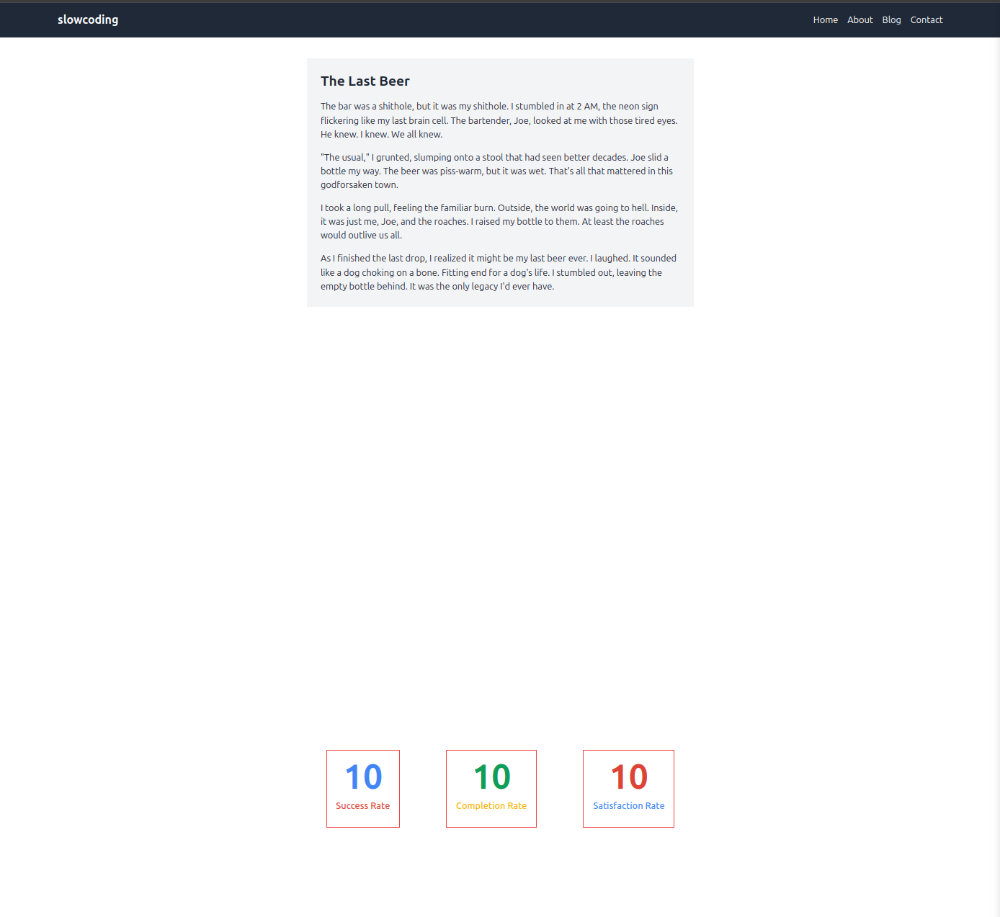

## Counter Project

### React Interview Question 2

This project, **Counter**, is part of my React katas that I use to sharpen my logic. The Counter component utilizes two packages:

1. **React Scroll Package**: This package makes it possible to trigger animations based on scroll position. You can find it [here](https://www.npmjs.com/package/react-scroll).
2. **React CountUp Package**: This package is used to animate the counter values. You can find it [here](https://www.npmjs.com/package/react-countup).

There is also a **Reset** button that resets the state, making the logic start from the beginning.

### Features

- **Scroll Triggered Animation**: The counter animations are triggered based on scroll position using the React Scroll package.
- **Count Up Animation**: The counters animate and count up using the React CountUp package.
- **Reset Functionality**: Resets the counter state to its initial configuration.

This project serves as an exercise to enhance logic and state management skills in React.

